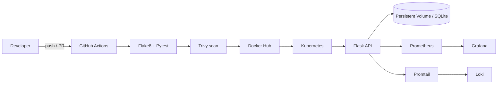

# Cloud-Native DevOps CI/CD Pipeline for a Flask Application

A portfolio-grade reference project showing how to ship a small Flask REST API with automated quality gates, container security, Kubernetes operations, AWS infrastructure, and observability.

## Architecture



## Features

- Flask application factory with health, CRUD, JSON logs, and Prometheus metrics.
- Multi-stage, non-root image with runtime health check.
- Kubernetes namespace, rolling Deployment, Service, Ingress, ConfigMap, optional Secret, PVC, probes, resource limits, and HPA.
- GitHub Actions quality, image publication, Trivy scanning, rollout status, rollback, and optional Slack notification.
- Prometheus alert rules, provisioned Grafana dashboard, Loki, and Promtail.
- Terraform AWS VPC/subnet/security group/EC2/IAM baseline and Ansible roles.
- Backup and restore scripts for the SQLite data volume.

## Quick start

```powershell
Copy-Item .env.example .env
python -m venv .venv
.venv\Scripts\Activate.ps1
pip install -r requirements.txt
pytest -q
flake8 app tests main.py
python main.py
```

Open `http://localhost:5000/api/v1/health`. Create a record with:

```powershell
Invoke-RestMethod http://localhost:5000/api/v1/students -Method Post -ContentType 'application/json' -Body '{"name":"Ada","age":22,"gender":"Female","marks":95}'
```

## Docker and observability

```powershell
docker compose up --build
```

- API: `http://localhost:5000`
- Prometheus: `http://localhost:9090`
- Grafana: `http://localhost:3000` (default local credentials are controlled by the image; change them for shared use)
- Loki: `http://localhost:3100`

## Kubernetes deployment

Build and push an image, replace the image in `kubernetes/deployment.yaml`, create a real Secret through your secret manager, then run:

```powershell
kubectl apply -k kubernetes
kubectl -n student-api rollout status deployment/student-api
kubectl -n student-api get pods,svc,hpa,ingress
```

Rolling updates provide zero-downtime replacement when readiness probes pass. A failed rollout is automatically undone by CI. Blue-green or canary promotion can be implemented with a second Deployment and a Service selector (or Argo Rollouts) before switching production traffic.

## GitHub Actions setup

Add repository/environment secrets: `DOCKERHUB_USERNAME`, `DOCKERHUB_TOKEN`, `KUBE_CONFIG` (base64 kubeconfig), and optionally `SLACK_WEBHOOK`. Every push to the default branch runs lint and tests, builds and scans the image, pushes the commit-tagged image, applies Kubernetes manifests, waits for rollout, and rolls back on failure.

## Terraform and Ansible

```powershell
Copy-Item terraform/terraform.tfvars.example terraform/terraform.tfvars
terraform -chdir=terraform init
terraform -chdir=terraform plan
terraform -chdir=terraform apply
ansible-playbook -i ansible/inventory.ini ansible/site.yml
```

Restrict `admin_cidr_blocks` to trusted IPs. Terraform state and credentials must be stored securely; use an encrypted remote backend for real environments.

## Folder guide

- `app/`, `tests/`: application source and unit tests.
- `docker/`, `docker-compose.yml`: image and local platform.
- `kubernetes/`: deployable manifests.
- `monitoring/`, `logging/`: metrics, dashboards, alerts, and log shipping.
- `terraform/`, `ansible/`: AWS provisioning and host configuration.
- `.github/`: CI/CD and collaboration templates.
- `scripts/`, `docs/`: operations and portfolio evidence.

## Security posture

No credentials are committed. Use GitHub encrypted secrets, AWS IAM least privilege, Kubernetes External Secrets/Sealed Secrets, restricted network CIDRs, non-root containers, dropped Linux capabilities, pinned dependencies, and Trivy scanning. The example Secret is intentionally a template only.

## Future improvements

Replace SQLite with managed PostgreSQL, add an API gateway and TLS certificate automation, use an external secret operator, add OpenTelemetry tracing, use EKS with IRSA, remote Terraform state, Argo Rollouts for canary analysis, and Alertmanager email/Slack routing.

## License

MIT. See [LICENSE](LICENSE).
